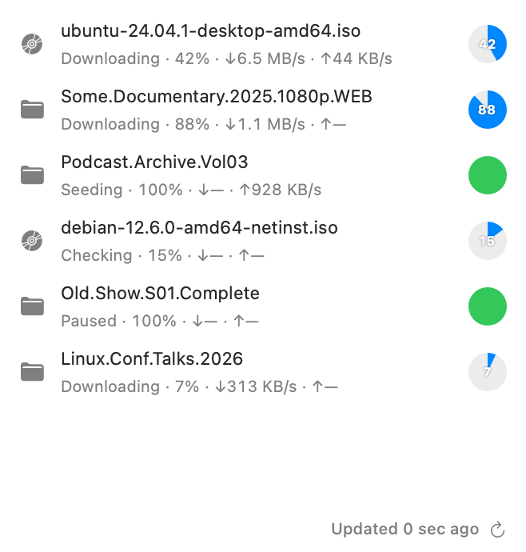

# Transmission Mac Widget

A macOS menu-bar app + WidgetKit widget that shows your most active
Transmission torrents (status, progress, ↓/↑ rate), talking directly to
Transmission's RPC endpoint — the same one `transmission-remote` and the
web UI use.

| `.systemMedium` | `.systemLarge` |
| --- | --- |
|  |  |

*(Rendered with fixture data via `make screenshots` — see
`Tools/ScreenshotRenderer`. It uses `ImageRenderer` to draw the widget
off-screen, so there's no live widget host or screen-recording permission
involved; run it again after a UI change to refresh these.)*

The project is described by `project.yml` for XcodeGen; the generated
`.xcodeproj` is a build artifact and isn't checked into git.

## Before you build: set up your own team

`project.yml`'s `DEVELOPMENT_TEAM` is the original author's Apple
Developer Team ID — it's checked in so the project builds out of the box
for them, but it won't sign anything for you. Replace it with your own
Team ID (Xcode → Settings → Accounts → your Apple ID → Team, or
developer.apple.com → Membership) before building, then run
`make generate` (or `xcodegen generate`) to regenerate the project.
A free personal team works fine for local use — see Warnings below for
the one caveat that comes with it.

## Build it and put it on your Mac

A Debug build launched via Xcode's Run button quits the moment you stop
the Xcode session, which defeats the point of a menu-bar widget host — so
you want an exported, signed `.app`. The `Makefile` automates the
archive/export flow that would otherwise mean clicking through Xcode's
Organizer by hand:

- `make app` — archives (Release) and exports a signed
  `TransmissionWidgetHost.app` to `build/export/`.
- `make install` — does the above, then copies the result into
  `/Applications`.
- `make screenshots` — regenerates the widget images above.
- `make clean` — removes build artifacts.

First launch will likely get Gatekeeper's "unidentified developer"
warning since it's not notarized — right-click the app → **Open** once to
bypass that; after that it opens normally. Since it's set as
`LSUIElement`, it won't show a Dock icon — look for it in the menu bar.

The widget itself works independent of whether this app is running —
WidgetKit manages the extension's process on its own schedule. The host
app is just a menu bar icon with a Quit item; adding it to
**System Settings → General → Login Items** is optional, purely for
convenience.

## Configuring the widget

There's no host app settings window — the widget extension does
everything on its own (fetching, caching, configuration), and the host
app is just a menu bar icon with a Quit item. Add the widget (Notification
Center → Edit Widgets, or long-press an existing one on the Desktop) and
choose **Edit Widget** to set the host, port, RPC path, HTTPS toggle,
username, and password. Each widget instance keeps its own configuration,
managed by WidgetKit itself — no App Group or Keychain sharing involved.

In Transmission's settings (`settings.json` or the daemon's web UI
preferences), you'll want:

- `rpc-enabled: true`
- `rpc-port`, `rpc-url` matching what you enter in Edit Widget (defaults
  here assume port `9091`, path `/transmission/rpc`)
- If Transmission is reachable only from a different host/network than
  the one this app runs on, make sure `rpc-whitelist-enabled` /
  `rpc-whitelist` / `rpc-host-whitelist` are configured to allow
  connections from wherever this Mac actually connects from.
- Basic auth (`rpc-authentication-required`, `rpc-username`,
  `rpc-password`) is optional but recommended if the daemon is
  reachable beyond localhost.

## Warnings

- **Free Apple ID signing expires weekly.** If you're signing with a free
  personal team (no $99/year Developer Program), the provisioning profile
  Xcode generates expires after about a week — you'll need to `make app`
  (or `install`) again periodically to refresh it. A paid Developer ID
  membership avoids this entirely; for a personal home-server tool either
  is fine, just know the free path needs an occasional rebuild.
- **The password is visible in the Edit Widget sheet.** WidgetKit's
  configuration form has no secure/masked field type, so it's stored (and
  shown) as plain text alongside the other settings. Fine for a personal,
  local-network tool; don't reuse a password you care about elsewhere.
- **App Groups don't work on a free Personal Team**, which is why the
  widget owns everything itself instead of splitting state with the host
  app — Apple only provisions the App Groups capability for a paid
  Developer Program membership, and this project intentionally avoids
  needing it at all.
- **Refresh cadence** is `Constants.refreshInterval` in
  `Shared/Constants.swift` — how often the widget asks WidgetKit to check
  back for a new timeline entry. Free to ask for something short, since
  WidgetKit's own budget/visibility throttling decides the real-world
  cadence regardless.
- Widget-animation tricks (private `_ClockHandRotationEffect`, or
  timer+font-ligature flicker) don't fetch new data — they just make
  stale data look busier. The refresh button forces an immediate
  check, but it still shares WidgetKit's system-wide reload budget.
